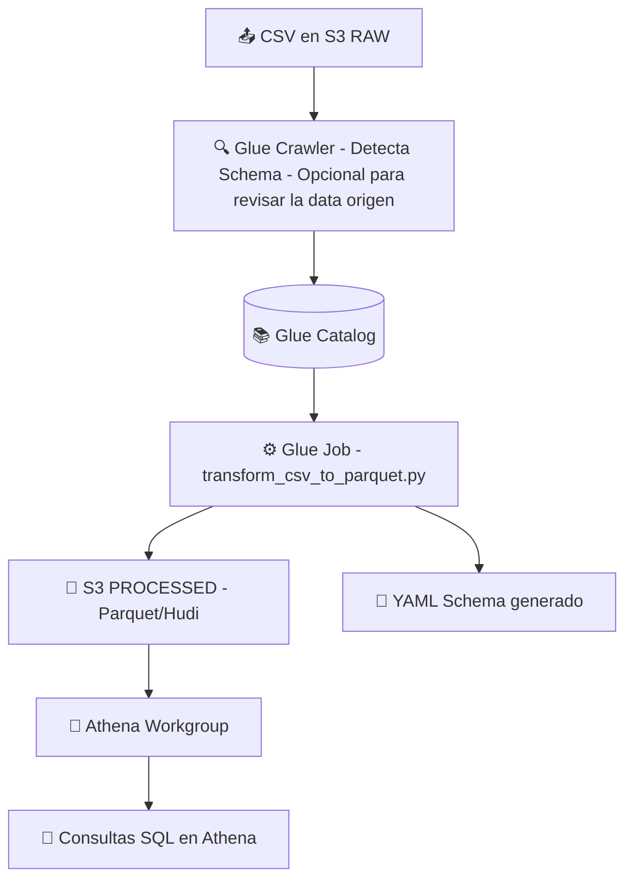

# 🧠 Lakehouse Challenge
Proyecto implementa una arquitectura tipo **Data Lakehouse** sobre **AWS**, utilizando **Terraform** como Infraestructura como Código (IaC) y **AWS Glue** para el procesamiento de datos.

## 🚀 Objetivo
Implementar un flujo completo que permita:
1. **Cargar datos CSV**: se tendrá como input del proceso un bucket `raw`, en una carpeta (folder) `data`.
2. **Detectar y catalogar**: se creará un **Glue Crawler** con la finalidad de poder explorar los datos iniciales.
3. **Transformar los datos**: la transformación implicará llevar el archivo CSV original a formato **Parquet/Hudi**, utilizando un **Glue Job** en PySpark.
4. **Generar y Guardar Esquema**: el proceso generará el archivo YAML con el `schema` identificado desde el archivo CSV, considerando tipos de datos amigables.
5. **Consulta de Datos**: los datos transformados también estarán disponibles en **AWS Athena**.
6. **Aplicar control de acceso y roles**: se asignarán los roles y políticas necesarias utilizando como base **AWS LakeFormation**.

## 📂 Estructura del Proyecto
La estructura del proyecto contiene las carpetas y archivos mínimos para la ejecución exitosa de la prueba:
```
lakehouse-challenge/
│
├── data/
│ └── customers_data.csv # Archivo de entrada para la prueba
│
├── iac/
│ ├── main.tf            # Definición principal de recursos Terraform
│ ├── variables.tf       # Variables de configuración
│ └── terraform.tfvars   # Valores por defecto para entorno dev
│
└── src/
  └── jobs/
    └── transform_csv_to_parquet.py # Script de transformación en Glue
```

## 1️⃣ Infraestructura como Código (IaC)
La infraestructura se despliega completamente con **Terraform** y crea los siguientes recursos:

| Componente | Descripción |
|-------------|-------------|
| **S3 Buckets** | Almacenamiento para datos `raw`, datos `processed`, `scripts` y resultados de consultas de Athena. |
| **IAM Role y Policies** | Permisos para Glue y Athena sobre los buckets definidos. |
| **Glue Database** | Catálogo de metadatos para tablas generadas. |
| **Glue Crawler** | Detecta automáticamente el esquema del dataset CSV (este componente es opcional). |
| **Glue Job** | Ejecuta la transformación CSV hacia Parquet/Hudi. |
| **Athena Workgroup** | Define ubicación para resultados de consultas. |

## 2️⃣ Requisitos Previos
Como pasos previos, se debe asegurar lo siguiente:

**AWS CLI** y **Terraform** correctamente instalados. En caso estar en una estación `Windows` (como se realizó en este ejemplo), se debe realizar la instalación via `PowerShell` para mayor facilidad.

Abrir PowerShell como Administrador e instalar Chocolatey (si no está instalado): `Chocolatey` es un gestor de paquetes para Windows que facilita la instalación de herramientas de desarrollo.

```powershell
Set-ExecutionPolicy Bypass -Scope Process -Force; `
[System.Net.ServicePointManager]::SecurityProtocol = `
[System.Net.ServicePointManager]::SecurityProtocol -bor 3072; `
iex ((New-Object System.Net.WebClient).DownloadString('https://community.chocolatey.org/install.ps1'))
```
Luego de completado se puede verificar la instalación:
```powershell
choco --version
```

Luego instalar **AWS CLI** y **Terraform (la versión debería ≥ 1.6.0)**:
```powershell
choco install awscli -y
aws --version
```
```powershell
choco install terraform -y
terraform -version
```

Para prepara el ambiente, configurar la cuenta de AWS mediante `aws configure` (***se debe tener un usuario con privilegios para administrar y crear recursos en AWS***):

```powershell
AWS Access Key ID [None]: <ACCESS_KEY>
AWS Secret Access Key [None]: <SECRET_KEY>
Default region name [None]: us-east-1
Default output format [None]: json
```

## 3️⃣ Configuración
Se tienen los archivos `iac/terraform.tfvars` y `iac/variables.tf`, donde se detallan los parámetros base para la configuración del proyecto.

Este es el contenido del primer archivo mencionado:
```hcl
region        = "us-east-1"
environment   = "dev"
project_name  = "lakehouse-challenge"
```

## 4️⃣ Despliegue
### Inicializar el entorno Terraform:
```bash
cd iac
terraform init
```

## 5️⃣ Ejecución de la Prueba
Para la preparación de la prueba, se utilizará la Consola AWS para facilidad de captura de evidencias. Considerar que los nombres de los elementos podría variar basándose en los parámetros ingresados **Terraform**.

Una vez terminada la ejecución de la infraestructura, ingresar a la consola AWS, ir al servicio buckets y subir el archivo de muestra CSV a la ruta: `s3://lakehouse-challenge-dev-raw/data/`:
<br></br>

<br></br>
**OPCIONAL:** Ir al servicio `AWS Glue > Crawlers` y ejecutar el crawler de exploración de datos iniciales `lakehouse-challenge-dev-raw-crawler`:
<br></br>

<br></br>
En el mismo servicio `AWS Glue`, ir a `ETL jobs` y ejecutar el job de transformación `lakehouse-challenge-dev-job`:
<br></br>

<br></br>
Una vez culminado, ir al servicio `Athena`, seleccionar el `workgroup` creado `lakehouse-challenge-dev-wg`, y procesar la consulta. En caso se haya ejecutado el paso opcional, se podrá ver la tabla asociada al archivo original CSV:
<br></br>

<br></br>
## 6️⃣ Limpieza del Entorno
```bash
cd iac
terraform destroy
```

## 7️⃣ Explicación del Flujo de Datos


Resumen del Proceso:
1. El archivo CSV se carga en el bucket S3 RAW.
2. Glue Crawler analiza el archivo y registra su esquema en el Glue Data Catalog (este paso no es obligatorio ya que solo se utiliza para exploración inicial).
3. El Glue Job (transform_csv_to_parquet.py):
   - Lee el dataset desde el bucket RAW.
   - Genera un archivo de esquema YAML con los metadatos detectados.
   - Convierte el CSV a formato Hudi/Parquet.
   - Escribe los datos transformados en el bucket S3 PROCESSED.
4. Athena consulta los datos procesados a través del Glue Catalog.
5. Los roles IAM aseguran que solo los servicios definidos (Glue y Athena) tengan acceso a los buckets correspondientes.
